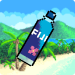

<h1 align="center">Drink Your Water</h1>

    
    
    

Este projeto é uma extensão simples que funciona como reminder para se lembrar de beber água e se manter hidratado enquanto mexe no computador. 

<h3>Configurar o tempo das notificações</h3>

Dentro do popup, você tem acesso a uma interface simples para configurar o tempo que deseja para seu timer.

<h3>Sobre o projeto</h3>

A ideia deste projeto é aprender como funciona o desenvolvimento de uma extensão no Chrome. Para desenvolver esta aplicação, aprendi a configurar ambientes, como é o funcionamento das permissões do navegador e as API's internas do Chrome Extension!

### Idealizador

| [Nicolas](https://github.com/nicochess)               |
| ------------------------------------------------------|
|  |
